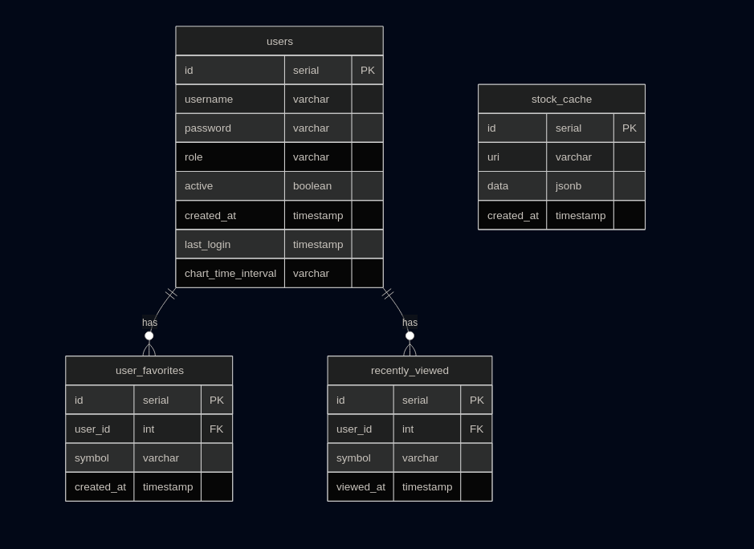

# InvestTracker
A web app to browse stock market items using data from the Yahoo Finance API.

## Functionalities
- Personal accounts
  - Auto-register
  - Browsing history up to the latest five items (can be cleared)
  - Favorite items
  - Preferences regarding time intervals on the price chart
  - Deactivating an account without deleting its data (admin functionality)
- Searching items
- Caching query results for a few minutes to avoid getting rate-limited
- Displaying detailed quote info
  - Price chart with a configurable interval
  - Basic technical & financial indicators
- Three-column dashboard
  - Recently viewed
  - Popular items
  - Indices
- Inline search in the top bar

## Setup
Build & run or restart
```shell
docker compose up -d
```

Stop
```shell
docker compose down
```

## ERD diagram


## Demonstrational video
https://github.com/user-attachments/assets/8dd7cd8e-4f16-409f-82b3-3d620c834975

